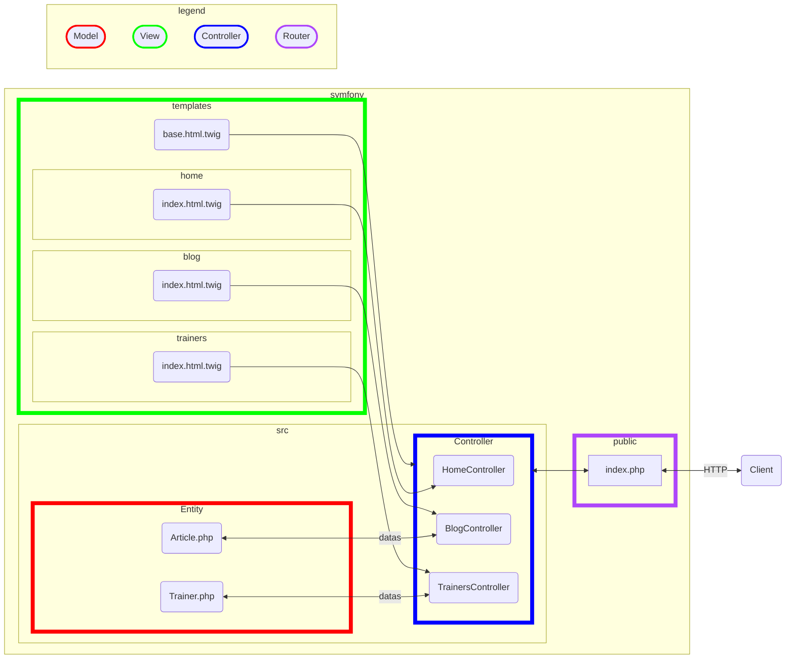
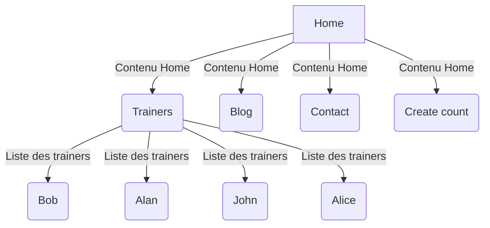

# Installation

⛅ Cours Symfony 

Pour utiliser Symfony il faut :

-  PHP 8.1 intl, pdo_mysql, xsl, amqp, gd, openssl, sodium ou plus & les extensions suivantes :
 curl et zip.

 *Dans votre configuration MAMP ou WAMP, cela devrait être le cas.*

Ouvrez un terminal et tapez la ligne de commande suivante pour voir les extensions de votre PHP :

🐚

```bash
php -m
```

- De manière optionelle vous pouvez installer la CLI de Symfony :

*Remarques : une CLI ou Command Line Interface, est une suite de programmes exécutables en ligne de commandes, écrit en PHP et permettant de créer des controller, model, view. Elle permet également le testing et le déploiement de l'application.*

🐚

- Pour Mac

```bash
curl -sS https://get.symfony.com/cli/installer | bash
```
Une fois la CLI de Symfony installée vous pouvez y accéder de manière gloable :

🐚

```bash
mv /Users/votre_nom_de_machine/.symfony/bin/symfony /usr/local/bin/symfony
```

*Voir sur cette page les autres options selon votre OS.*

[Dowload Symfony](https://symfony.com/download)

- Pour Windows utilisez scoop

🐚

```bash
scoop install symfony-cli
```

- Il faut également le gestionnaire de package PHP **composer**, voir l'installation directement sur le site de composer (rien de compliqué).

Composer doit-être installé et à jour.

- Mise à jour de composer

🐚

```bash
# mise à jour de composer
composer self-update
```

- Installation du projet 

Vous pouvez soit installer Symfony soit en microservice, soit en full.

Microservice est très adapté par exemple pour la création d'API (Application programming Interface).

Full correspond à une installation pour les Web App "traditionnelle".

Pour **découvrir Symfony**, nous allons faire les deux installations : **microservice** et **full**.

Vérifiez avant de continuer que votre système est correctement configuré avec la CLI de SF :

🚀

```bash
symfony check:requirements
```

## Installation 

Sur votre bureau dans un dossier **web-trainer** tapez dans la console la ligne de commande suivante :

🚀

```bash
symfony new web-trainer
```

Avec composer uniquement, vous pourvez taper la ligne de commande suivante ( dans le dossier web-trainer) :

🚀

```bash
composer create-project symfony/skeleton web-trainer
```

Vérifiez la configuration, placez-vous dans le dossier **web-trainer** et tapez la ligne de commande suivante (commandes SF) :

🚀

```bash
php bin/console about
```

Nous allons également voir toutes les commandes de la console disponibles pour une application.

**Remarque** : une commande de la console permet par exemple de créer (makers) un "controller" **automatiquement** dans l'application (création et import des classes directement dans le fichier). L'intérêt de créer un contrôleur, à l'aide d'une commande de la console est que Symfony **définit lui-même**  les dépendances SF du controller de SF :

🚀

```bash
php bin/console
```

Nous reviendrons sur l'utilisation de ces commandes ci-dessous.

Nous allons lancer le serveur de test Symfony, dans le dossier de notre application, tapez la ligne de code suivante, vous pouvez avant de la lancer obtenir sa documentation, voyez la première ci-dessous.

🚀

```bash
symfony help server:start
```

Pour lancer le serveur lui-même :

🚀

```bash
symfony server:start
```

Ouvrez également un autre terminal à côté pour que l'on puisse exécuter des commmandes de la console Symfony.

1. Le framework utilise comme point d'entrée (FrontController) : l'index.php dans le dossier public

1. Le Kernel, en fonction d'une route spécifique, déclenchera une autre action spécifique appelle d'une méthode ou action dans une classe le controller, qui orchestrera la réponse.

*Le router gère les actions/contrôleurs métiers, c'est lui qui fait ce mapping.*

1. Une réponse est retournée au client HTTP ( le navigateur par exemple).

## Présentation de la structure d'une App Symfony

```txt
dev-trainer/
├─ assets/         <- Les assets JS et CSS (framework css)
├─ bin/
│  └─ console
├─ config/
│  ├─ packages/
│  └─ services.yaml
├─ migrations/      <- Les fichiers qui permettent de créer les tables
├─ public/
│  ├─ build/        <- Les fichiers builder de vos application Front
│  └─ index.php
├─ src/
│  ├─ Kernel.php
│  ├─ Command/
│  ├─ Controller/   <- Chef d'orechestres
│  ├─ DataFixtures/ <- Données d'exemple
│  ├─ Entity/       <- Les modèles qui représentent les tables
│  ├─ EventSubscriber/
│  ├─ Form/
│  ├─ Repository/   <- Requête personnalisées 
│  ├─ Security/
│  └─ Twig/         <- Les extensions Twig
├─ templates/       <- Les templates Twig
├─ tests/
├─ translations/    <- Fichiers de traduction
├─ var/
│  ├─ cache/
│  └─ log/
└─ vendor/         <- Les dépendances de votre application comme Symfony (...)
```

- config/
*Vous permet de configurer l'application ... Par exemples : définition des routes, services ou packages installés.*

- src/
*Cet ici que vous écrivez le code de l'application que vous développerez.*

- templates/
*Toutes les vues HTML/JS seront développées dans ce dossier, avec twig par exemple.*

- bin/
*Tous les exécutables PHP seront placés dans ce dossier. Vous trouverez nottament la fameuse console de Symfony.*
- var/
*Les fichiers qui se trouvent dans ce dossier sont créés automatiquement, vous trouverez par exemple les fichiers de cache de l'application ainsi que ses logs.*

- vendor/
Ce dossier contient toutes les dépendances de votre application comme Symfony par exemple.

- public/
*Dans ce dossier est placé tous les fichiers accessibles publiquement assets, js et le point d'entrée de votra application l'index.php*

## Schéma Symfony 



## Le projet fil rouge pour la semaine Web tainer

Nous allons créer une application qui présente une petite équipe de formateurs. Chaque formateur aura sa propre page et écrit des articles. La page d'accueil affichera plus tard les articles les plus recents ou événements importants. 

Nous vous guiderons dans l'implémentation de l'ensemble des features, sur l'ensemble des cours SF, pour expliciter les notions importantes de ce Framework.

### Installation

Déjà vu plus haut.

### Création du contrôleur HomeController

Dans un Framework on utilise la ligne de commande (CLI) pour créer les classes métiers qui dépendantes du Framework. Voici les commandes utiles pour créer un contrôleur avec Symfony.

Comme nous utilisons l'option **microservice** pour découvrir Symfony (installation not full), vous n'avez pas de commande maker, pour l'instant, permettant de créer automatiquement un contrôleur.

- Installez dans SF à l'aide de la CLI et en ligne de commande ce maker, il s'ajoutera aux commandes de la CLI SF

🚀

```bash
symfony composer req maker --dev
```

Listez dans la console maintenant ces dépendances.

🚀

```bash
symfony console list make
```

### Installation de Twig moteur de template

Installez maintenant **le moteur de template Twig**, il permet de gérer les vues HTML de manière dynamique ( méta-langage Twig ou moteur de template).

🚀

```bash
composer require twig
```

**Remarque** : vous pouvez également désinstaller un composant. Par exemple si vous souhaitez désinstaller Twig vous taperez :

🚀

```bash
composer remove twig
```

Un dernier point pour Twig, vous pouvez vérifier la configuration de Twig pour votre application à l'aide de la commande suivante :

🚀

```bash
 php bin/console debug:config twig
 ```

 Pour la gestion moderne des JS, CSS et autres assets on installera **AssetMapper**, un dossier assets sera créé à la racine du projet.

 🚀

 ```bash
 composer require symfony/asset-mapper symfony/asset symfony/twig-pack
 ```

 Dans vos page HTML vous utiliserez alors la syntaxe suivante pour liées vos images, JS ou CSS ( nous allons mettre cela en place plus loin dans le projet fil rouge).

 ```html

    {{ importmap('app') }}

```

Remarques sur AssetMapper, quelques commandes :

1. pour la production, il faudra penser à **builder** vos assets (pas maintenant) :

🚀

```bash
php bin/console asset-map:compile
```

1. Pour voir le mapping de vos dépendances avec vos assets

🚀

```bash
php bin/console debug:asset-map
```

1. Si vous changez d'ordinateur pensez à ré-installer vos dépendances (assets)

🚀

```bash
php bin/console importmap:install
```

### Création du controller HomeController

Deux syntaxes, si vous appelez Home votre controller SF vous nommera automatiquement la classe **HomeController**, voyez également, si twig est installé, le dossier **home** sera également automatiquement créer dans le dossier **templates**.

Vous deux commandes pour créer un controller :

🚀

```bash
symfony console make:controller Home
# php bin/console make:controller Home 
 ```

 Symfony crée un contrôleur, en utilisant les routes de type **attribut** ( du pur PHP ). Ouvrez le dossier **src/Controller** dans le projet. Vous trouverez le contrôleur **HomeController**. 

 Notez que la route est ici **/home** (voir les attributs de la classe), elle est crée en fonction du nom du controller.
 

```php
<?php
namespace App\Controller;

use Symfony\Bundle\FrameworkBundle\Controller\AbstractController;
use Symfony\Component\HttpFoundation\Response;
use Symfony\Component\Routing\Annotation\Route;

class HomeController extends AbstractController
{
    #[Route('/home', name: 'app_home')]
    public function index(): Response
    {
        // SF utilise le templace index.html.twig pour construire la vue
        return $this->render('home/index.html.twig', [
            'title' => 'HomeController', // tableau associatif pour passer des valeurs à la vue
        ]);
    }
}
```

Si votre serveur de test est lancé (**symfony server:start**), testez la route suivante /home, vous devriez voir la page Twig que nous venons de créer (vérifiez le port, il correspondre à votre serveur de tests).

```txt
http://127.0.0.1:8000/home
```

Les templates se trouvent dans les dossiers suivants :

```txt
templates/
    home/
        index.html.twig
    base.html.twig
```

Le layout (modèle) **base.html.twig** est un template que les vues composites, comme **index.html.twig**, hériteront. Cela permet de "factoriser" du code qui se répète dans toutes les pages.

## 01 Exercice duck

Mettez un petit canard dans la page d'accueil.

1. Vérifiez que AssetMapper est installé.
1. Vous avez un dossier assets
1. Créez le dossier images
1. Placez l'image dans ce dossier
1. Dans le code du HTML écrivez ce qui suit pour télécharger l'image dans la vue

```html
<!-- si le nom de votre image est duck.png -->

```

## 02 Exercice Tailwindcss

1. Installation de Tailwindcss (framework CSS), dans le projet Web trainer.

🚀

```bash
composer require symfonycasts/tailwind-bundle
php bin/console tailwind:init

# build and watch tailwind
php bin/console tailwind:build --watch
```

1. Configuration de Tailwind pour l'avoir au démarrage dans votre serveur de test ( CLI server start)

Créez le fichier .symfony.local.yaml à la racine du projet et mettez le code suivant, redémarrez SF, vous avez maintenant le watch de Tailwind en place dans le projet.

```yaml
# .symfony.local.yaml
workers:
    tailwind:
        cmd: ['symfony', 'console', 'tailwind:build', '--watch']
```

## Introduction à Twig 

Twig est un moteur de template qui permet de créer des vues dynamiques. Il s'agit d'un méta-langage qui sera traduit en code source PHP, puis exécuté par le framework pour générer les pages HTML.

1. Il permet d'échapper les caractères spéciaux qui pourraient introduire des failles de sécurité. L'instruction suivante en PHP :

```php
<?php echo htmlspecialchars($var, ENT_QUOTES, 'UTF-8') ?>
```

Est équivalant à dans Twig (**syntaxe** du moteur de template) :

💙

```php
{{ var }}
```

1. Permet de faire une boucle sur un tableau PHP (c'est le controller qui passera ce tableau à la vue).

```html

    {{ user.name }}

    No users have been found.

```

- Dans le controller HomeController par exemple, on aura :

```php
#[Route('/home', name: 'app_home')]
    public function index(): Response
    {
        $users = [
            ['name' =>'Alan',],
            ['name' =>'Bob',],
            ['name' =>'Alice',],
            ['name' =>'John',],
        ];

        return $this->render('home/index.html.twig', [
            'title' => 'HomeController',
            'users' => $users
        ]);
    }
```

1. if Twig

- Condition simple

```html

    <ul>
        
            <li>{{ user.username|e }}</li>
        
    </ul>

```

- Condition if avec else

```html

HTML ...

HTML ...

```

1. Utilisation de pipe ( fonction PHP) sur des variables Twig, ici on applique length sur la variable users pour avoir la longueur du tableau.

```twig

```

1. Héritage d'un layout pour factoriser un modèle qui s'appliquera à toutes les pages

```html



    Content of the page...

```

- Dans le fichier **index.html.twig** du dossier home, on héritera de ce layout comme suit :

```html


Hello HomeController!



    votre code ici ...

```

1. Inclure des fichiers dans le dossier templates dans des fichiers Twig 
```html
{{ include('page.html', sandboxed = true) }}
```

Il y a bien d'autres fonctionnalités Twig que nous découvrirons en pratique dans l'application fil rouge que nous allons développer ensemble.

[symfony-twig](https://symfony.com/doc/current/templates.html)

Remarque : pour connaitre la version de Twig que vous utilsiez voyez le fichier composer.json :

```json
"symfony/twig-bundle": "7.0.*",
```

## 03 Affichez les données trainers

En utilsant ce que l'on a vu dans le cours avec le contrôleur et la vue.

1. Affichez les données ci-dessous dans la page trainer.
1. Créez une mise en forme avec les styles CSS du Framework css Tailwind.
Chaque trainer sera dans un div stylisé (css du framework).
1. Ordonnez décroissant les trainers en fonction de leur nombre d'étoiles.
1. Ajoutez un style spécifique pour étoiles.
1. Nous avons ajouté un champ rates qui comporte maintenant des valeurs; faite la moyenne des rates, si cette donnée existe. Utilisez les conditions en Twig pour afficher cette informaation dans la page.
1. Créez maintenant un menu main-menu.html.twig qui sera présent sur toutes les pages, faites un include comme vu dans le cours plus haut.

```php
$trainers = [
    [
        'name' => 'Alice Johnson',
        'address' => '123 Oak Street',
        'phone' => '555-1111',
        'star' => 4,
        'rates' => [11, 18, 10, 7 ]
    ],
    [
        'name' => 'Bob Smith',
        'address' => '456 Pine Avenue',
        'phone' => '555-2222',
        'star' => 25,
        'rates' => [13, 10, 7, 7.5, 19, 20, 17 ]
    ],
    [
        'name' => 'Charlie Davis',
        'address' => '789 Maple Lane',
        'phone' => '555-3333',
        'star' => 1
    ],
    [
        'name' => 'David Wilson',
        'address' => '234 Cedar Road',
        'phone' => '555-4444',
        'star' => 40
    ],
    [
        'name' => 'Eva Martin',
        'address' => '567 Birch Boulevard',
        'phone' => '555-5555',
        'star' => 5
    ],
    [
        'name' => 'Frank Miller',
        'address' => '890 Walnut Drive',
        'phone' => '555-6666',
        'star' => 7
    ],
    [
        'name' => 'Grace Turner',
        'address' => '345 Sycamore Street',
        'phone' => '555-7777',
        'star' => 14,
        'rates' => [1, 9, 5, 9, 10, 20, 20 ]
    ],
    [
        'name' => 'Henry Harris',
        'address' => '678 Redwood Avenue',
        'phone' => '555-8888',
        'star' => 15
    ],
    [
        'name' => 'Ivy White',
        'address' => '901 Pine Lane',
        'phone' => '555-9999',
        'star' => 8
    ],
    [
        'name' => 'Jack Turner',
        'address' => '123 Elm Road',
        'phone' => '555-0000',
        'star' => 2
    ],
    // Ajoutez d'autres trainers avec des noms fictifs
];

```

## 05 Exercice Wireframes 

1. Réinstallez un projet SF trainer sur votre machine avec la configuration que nous avons faite dans le cours.

1. Introduction au projet fil rouge.  

Vous allez réaliser une page princiaple sur deux colonnes, en utilisant **Tailwindcss** ou vos propres framework css, voyez le Wireframe ci-dessous.

Bien sûr vous allez utiliser Twig pour réaliser chacune des intégrations. Aidez-vous de la documentation officiel.

On ne vous demande pas de faire un maquettage graphique du projet, utilisez les wireframes ci-dessous et surtout un Framework CSS pour intégrer les pages.

1. Dans le cas où vous voulez changer de Framework CSS voyez la documentation en ligne : [assetmapper](https://symfony.com/doc/current/frontend/asset_mapper.html)

1. Si vous utilisez Tailwindcss ou un autre Framework CSS utilisez la documentation suivante : [tailwindcss](https://tailwindcss.com/docs/installation)

1. Nous allons construire l'arborescence suivante.



- Intégrez la page ci-dessus ( simplement en CSS)

🚧 

1. Créez le controller Trainer
1. Créez le controller Blog
1. Créez le controller Contact

Pour les modèles, voir : [wireframe](###Wireframes)

### Détails des différentes pages à réaliser


1. Home (page d'accueil) : Elle répertoriera les derniers feedbacks rédigés par les formateurs, des cours réalisés. L'aspect fonctionnel de cette page sera mis en œuvre ultérieurement lors de la création de la base de données.

1. Trainers : Elle présentera la liste des formateurs ainsi que leurs compétences.

1. Blog : Il affichera les articles rédigés par les formateurs, offrant parfois la possibilité de laisser des commentaires sur certaines publications.

1. Contact : Elle fournira des informations sur la manière de contacter la société.

### Wireframes

1. home page


1. Trainers


1. Contact


